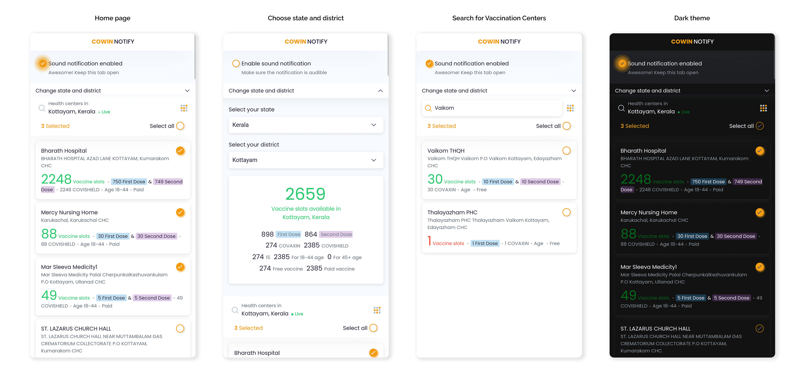
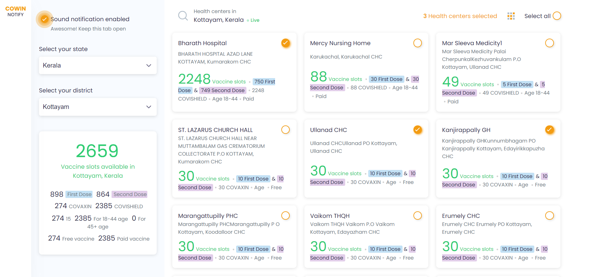

## Cowin notify - Real time updates on vaccine availability in your area

Cowin notify is a web application that helps you stay informed about Covid-19 vaccine availability in your area. It provides real-time updates on vaccine availability and allows you to easily select from multiple vaccine centers. With Cowin notify, you can receive notifications without the need for login, so you can stay informed and protected against Covid-19.

### Live

tkmpraveens.github.io/cowin-notify

### Features

- Real-time updates on vaccine availability in your area
- Ability to select any state, district, or union territory
- Select from multiple vaccine centers
- User state and district will be pre-filled automatically
- Receive notifications without the need for login

### Screenshots

### Frontend Tech Stack

- ReactJs, SCSS

### Getting Started

1. Clone the repository to your local machine: git clone the [repository](https://github.com/tkmpraveens/cowin-notify.git)
2. Navigate to the project directory: `cd cowin-notify`
3. Install the required dependencies: `npm i` or `npm install`
4. Start the development server: `npm start`
5. Open your browser and navigate to http://localhost:3000

### Contribution Guidelines

We welcome contributions to this project. If you find a bug or have an idea for a new feature, please fork the repository, make your changes, and submit a pull request.

### License

This project is licensed under the MIT License. See the LICENSE file for details.

### Contact

For questions or feedback, don't hesitate to contact us by opening an issue in the repository.
